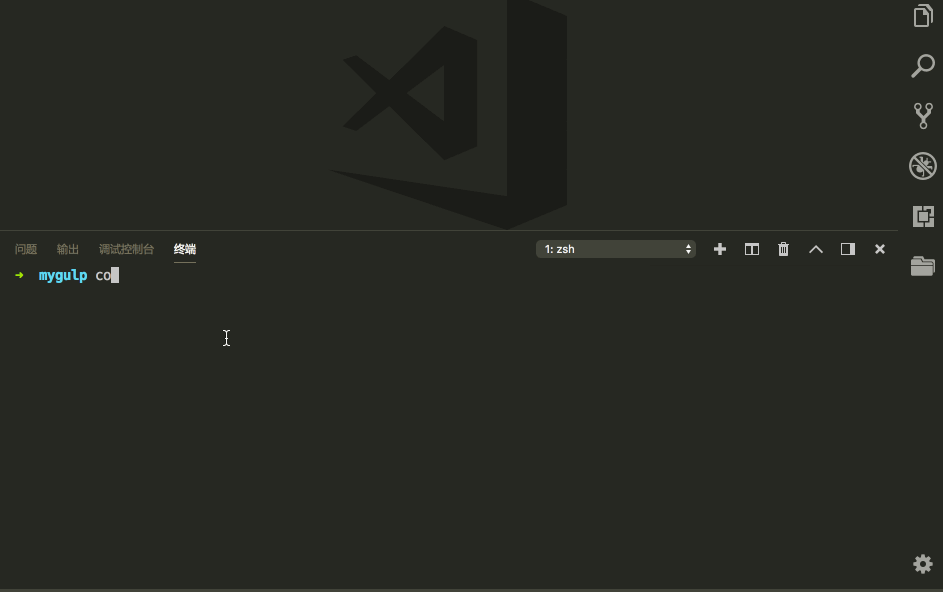
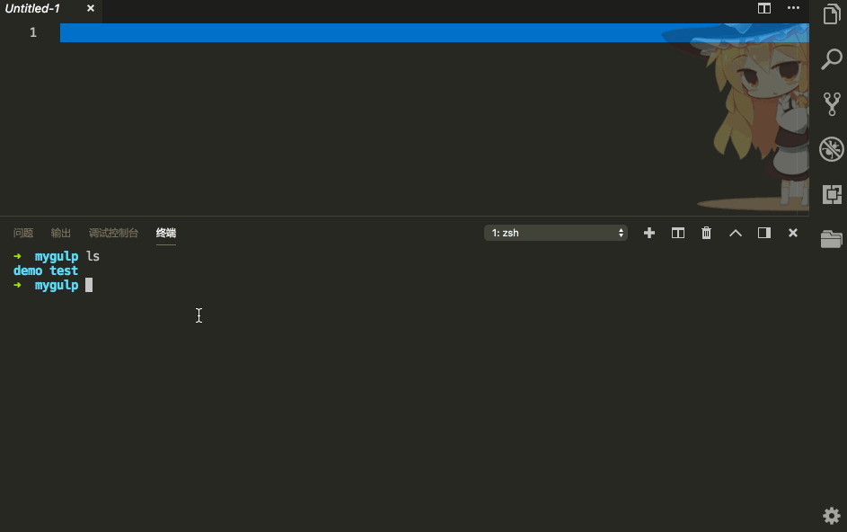

# zsh-shell-autocomplete
VSCode的侧边栏一直使用的不是很顺手，看到使用Vim的小伙伴天秀般操作，遂觉得应该给VSCode也加点料，就有了这个小玩意儿。
> A Simple ZSH Plugin, AutoComplete File Path, like Vim Plugin `ctrlp`
<br>

**Github仓库地址**：[zsh-shell-autocomplete](https://github.com/onvno/zsh-shell-autocomplete)


#### 基本说明
* 无需tab,输入即可自动联想（类似vim直接在编辑器中快速查找文件打开文件，如`ctrlp`）
* 因vscode编辑器自带终端，能够快速切换打开shell，遂根据需求，基于`incr-0.2`完成此插件。无需在vscode侧边栏滚来滚去查找\打开文件。


#### 支持范围

* Linux && MacOS
* VSCode


#### 功能演示
* 快速打开文件
```
$ code your/file/path
```


* 快速打开文件夹
```
$ code your/folder/path
```


* 其他autocomplete命令支持

  ```
  $ cd
  $ cat
  ```

  

#### 安装使用说明

1. 如何命令行使用`code`快速开启vscode:

   ```
   $ vi ~/.zshrc
   
   > # vscode使用命令行打开
   > export PATH=/Applications/Visual\ Studio\ Code.app/Contents/Resources/app/bin:$PATH
   
   # 保存退出
   $ source ~/.zshrc
   
   # 命令行使用code打开当前目录
   $ code .
   ```

2. 拷贝zsh插件`autoc.zsh`

   ```
   # 建议拷贝至oh-my-zsh个人插件目录:~/.oh-my-zsh/custom/plugins
   $ mkdir autoc
   $ cp your/path/autoc.zsh autoc/autoc.zsh
   
   # 添加插件source
   $ vi ~/.zshrc
   > source ~/.oh-my-zsh/custom/plugins/autoc/autoc*.zsh
   
   # 配置生效
   $ souce ~/.zshrc
   ```

   

####  参考

* [incr-0.2](http://mimosa-pudica.net/zsh-incremental.html)：功能强大，但无法收放自如，插件在此shell文件基础上更改


#### TODO

- 后续可以支持sublime & webstorm快速打开